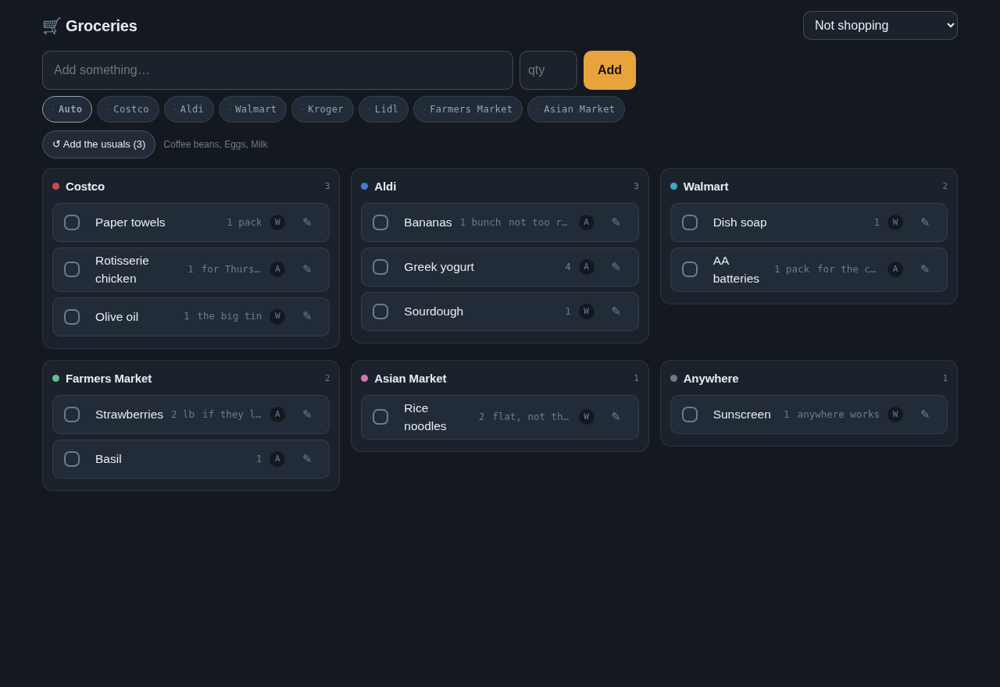
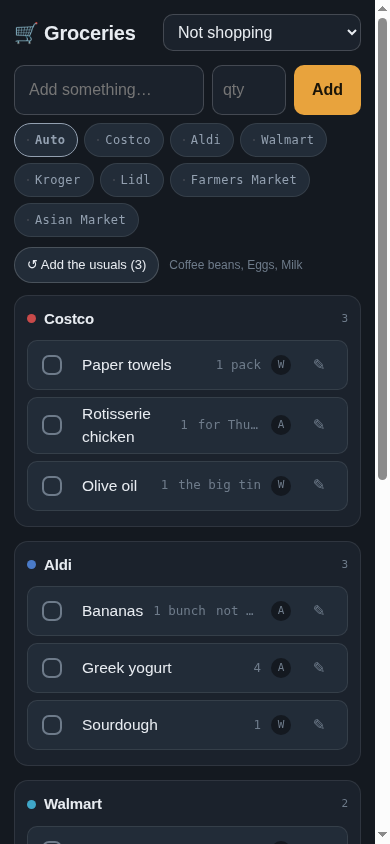
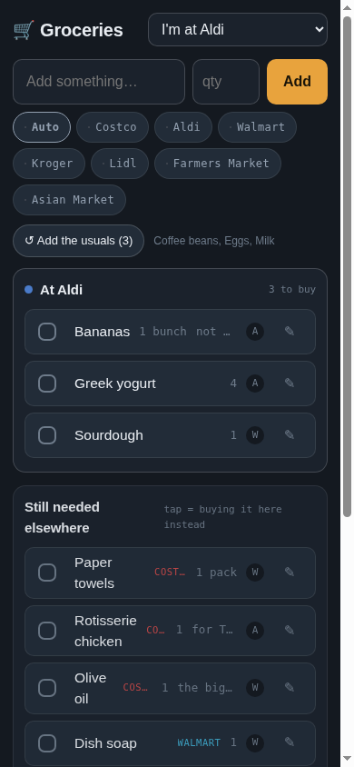

# Groceries

A shared supermarket list for a household, built around one observation: the
hard part is not remembering *what* to buy, it is remembering *where*. So the
list has a memory. Every item learns the store it is normally bought at, gets
pre-selected there next time, and the board is grouped by store rather than by
the order things were typed.

Then there is the mode that makes it useful in the aisle. Say you are at Aldi:
the app puts Aldi first, and everything still pending elsewhere collapses into
one "while you are out" list, so the meat you had assigned to Costco can still
be grabbed when it is right in front of you. Buying something at the wrong
store on purpose is treated as an exception and does **not** move the item's
home. Only adding it with an explicit store does.

FastAPI, Postgres and Jinja templates. No ORM, no build step, no JavaScript
framework: about 900 lines of Python and one stylesheet. It installs as a PWA
on a phone and syncs between phones every few seconds.



<p>
  
  
</p>

*Left: the board on a phone. Right: in-store mode at Aldi, with everything
pending elsewhere collapsed into one list you can still buy from.*

## Try it

```sh
cp .env.example .env      # only GRO_DB_PASSWORD needs a value
make demo                 # builds, starts, and loads a demo list
```

Then open <http://127.0.0.1:3030>. The demo data in `demo/seed.sql` is
invented: a plausible mid-week list, some history so the "usuals" row has
something to offer, and a couple of things already bought today. `make
demo-reset` puts it back.

Without the demo step you get an empty board and the seven default stores,
which is also a perfectly good place to start.

## Running for real

This is not a portfolio demo that was built and abandoned. It runs continuously
on a small home server, in Docker, and two people use it every day. The access
model is the part most worth copying:

- **Nothing is port-forwarded.** The home router has no inbound ports open, so
  there is no public attack surface pointing at the house.
- **The household reaches it from anywhere in the world** over a Tailscale
  tailnet: a phone on mobile data in another country gets the same app as a
  laptop on the sofa. `tailscale serve` terminates TLS with a real certificate,
  so it is proper HTTPS without exposing anything to the internet.
- **Exactly one path is public**, a Tailscale Funnel address, and it exists for
  one device that cannot join the tailnet (a work laptop with a managed
  profile). That path is the only one that ever sees the login in
  `app/gate.py`, and the session cookie is shared with the household's other
  apps, so one login covers all of them. Everything arriving from the private
  network is trusted and is never asked to authenticate, which is the whole
  design: put the authentication where the trust boundary actually is, not
  everywhere.
- **Backups run nightly and an uptime probe hits `/health` every couple of
  minutes.** Both live in a separate private infrastructure repo, because this
  repo is the app and nothing else.

## What is interesting in here

**The two-level store memory.** An item remembers its own home store. A
*category* also remembers one, learned only when somebody sets both on the
same item, never guessed. So a brand new item in a known category lands
somewhere sensible instead of in a pile called "Anywhere", and the app is
never confidently wrong about something it was never told.

**Live sync without a framework.** Phones poll a change fingerprint every four
seconds and re-render only when it moves, and they hold still while someone is
mid-typing or has an edit panel open. That is the entire real-time story, and
in a two-person household it is indistinguishable from websockets.

**A login only for the people who need one.** `app/gate.py` classifies the
request before it classifies the user: loopback, RFC1918 and Tailscale
addresses are trusted and never see a login screen, because being on the home
network is already the proof. Only visitors from the open internet get a
password prompt, and if the gate is not configured they are refused rather
than let in. Sessions are an HMAC-signed cookie, passwords are pbkdf2 hashes
that live in the host's `.env` and never in git.

**One codebase, two mounts.** The same instance answers on its own port and
under a path prefix behind a router, because every URL a template emits is
built from `X-Forwarded-Prefix`. That is what lets one deployment be both a
private app on a home network and a path on a public host.

## Layout

```
app/main.py        routes, schema, the store-memory rules
app/gate.py        who is trusted, who needs a password
app/templates/     Jinja, phone-first CSS with a desktop breakpoint
demo/seed.sql      the invented list used by `make demo`
docker-compose.yml app + postgres, loopback-bound on purpose
```

The committed compose file binds to loopback only: a reverse proxy or a VPN
is meant to be the way in. Host-specific extras, another port or a LAN
address, belong in a `docker-compose.override.yml`, which is git-ignored.

Configuration is all in `.env.example`, and every variable there is optional
except the database password.

## Status

Built in a day and in daily use by two people since, which is why the design
notes in [STATUS.md](STATUS.md) read like a running argument with reality. It
is worth a look if you want the reasoning rather than the code: what was built,
what was deliberately not built (offline mode is waiting for proven pain), and
which rules were decided after actually standing in a supermarket.

## How this was built

I built this with [Claude Code](https://claude.com/claude-code), using several
of Anthropic's models, and I would rather say that plainly than leave anyone to
guess. Most of the code in this repository was written by a model. The parts
that make it worth running were not.

What the split actually looks like:

- **The decisions are mine.** What to build, what to refuse to build, and the
  rules the app enforces: that buying something at a different store is an
  exception and never moves that item's home store. [STATUS.md](STATUS.md) is
  the record of those arguments, and most of them were settled by standing in
  a supermarket, not by planning.
- **The models wrote most of the implementation**, often several working in
  parallel on separate pieces, with a different model reviewing the diff before
  anything shipped. I read the parts that mattered, and I have been the one
  running it in production since day one.
- **Real use drove almost every change.** Two people live with this app. The
  improvements that mattered came from lists of things that annoyed us that
  week, not from a roadmap, and the bugs worth reading about were found by
  using it rather than by testing it.
- **Nothing destructive or public happened without my explicit go-ahead.**
  Dropping data, writing to the live deployment, making a repository public:
  each one waited for me to say so. That habit comes from my day job rather
  than from caution about the tools.

I use these tools every day and I think being straightforward about how the
work gets done is more useful than the alternative. The code, the commit
history and the design notes are all here to be judged on their own terms.

## License

MIT, see [LICENSE](LICENSE).
